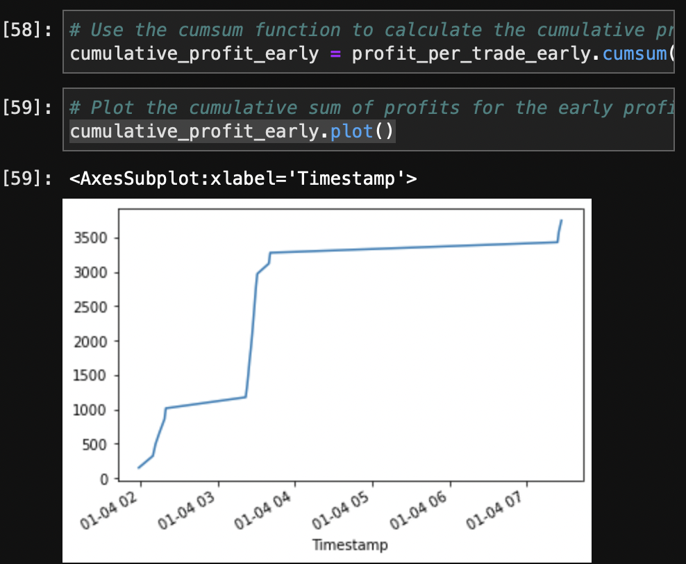

# Crypto Arbitrage
---

---
### This is an analysis of BTC prices on different exchanges for the purpose of analyzing arbitrage oppurtunities 

---

## Technologies 

This app leverages python 3.7 with the following packages:
* [pandas](https://github.com/pandas-dev/pandas) - For data analysis and manipulation.
* [pathlib](https://github.com/jazzband/pathlib2) - For file manipulation.
* [matplotlib_inline](https://github.com/ipython/matplotlib-inline) - For data visualizations.

---

## Installation 

1. Clone the repo 

2. Before running the program make sure to install the following dependencies: 
 
       '''python
         pip install pathlib'''
---        

## Usage

1. To use the Crypto Arbitrage application navigate to the ***Module_3_Challenge*** folder within the repo and run the ***crypto_arbitrage.ipynb*** file 

2. In the ***Resources*** folder you will find the datasets used for this analysis which contain price info on BTC from two different exchanges during early 2018 

3. To use your own data save it in the ***Resources*** folder and update the read_csv functions 

4. The dates and date ranges can be customized to your needs and if you follow the format the final output will be the cumulative arbitrage profits in your given date range

---

## Contributors

The starter code was contributed by the [FinTech Bootcamp at Columbia Engineering](https://bootcamp.cvn.columbia.edu/fintech/)

Matthew Field finalized the application, his work is availble to view on [Github](https://github.com/mbf2139)

---

## License

MIT